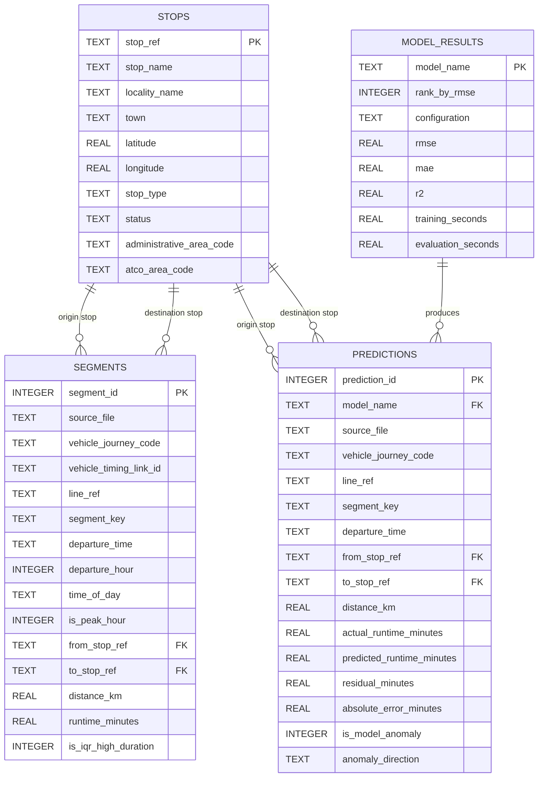

# Database Schema

```mermaid
erDiagram
    STOPS ||--o{ SEGMENTS : "origin stop"
    STOPS ||--o{ SEGMENTS : "destination stop"
    STOPS ||--o{ PREDICTIONS : "origin stop"
    STOPS ||--o{ PREDICTIONS : "destination stop"
    MODEL_RESULTS ||--o{ PREDICTIONS : "produces"

    STOPS {
        TEXT stop_ref PK
        TEXT stop_name
        TEXT locality_name
        TEXT town
        REAL latitude
        REAL longitude
        TEXT stop_type
        TEXT status
        TEXT administrative_area_code
        TEXT atco_area_code
    }

    SEGMENTS {
        INTEGER segment_id PK
        TEXT source_file
        TEXT vehicle_journey_code
        TEXT vehicle_timing_link_id
        TEXT line_ref
        TEXT segment_key
        TEXT departure_time
        INTEGER departure_hour
        TEXT time_of_day
        INTEGER is_peak_hour
        TEXT from_stop_ref FK
        TEXT to_stop_ref FK
        REAL distance_km
        REAL runtime_minutes
        INTEGER is_iqr_high_duration
    }

    MODEL_RESULTS {
        TEXT model_name PK
        INTEGER rank_by_rmse
        TEXT configuration
        REAL rmse
        REAL mae
        REAL r2
        REAL training_seconds
        REAL evaluation_seconds
    }

    PREDICTIONS {
        INTEGER prediction_id PK
        TEXT model_name FK
        TEXT source_file
        TEXT vehicle_journey_code
        TEXT line_ref
        TEXT segment_key
        TEXT departure_time
        TEXT from_stop_ref FK
        TEXT to_stop_ref FK
        REAL distance_km
        REAL actual_runtime_minutes
        REAL predicted_runtime_minutes
        REAL residual_minutes
        REAL absolute_error_minutes
        INTEGER is_model_anomaly
        TEXT anomaly_direction
    }
```
