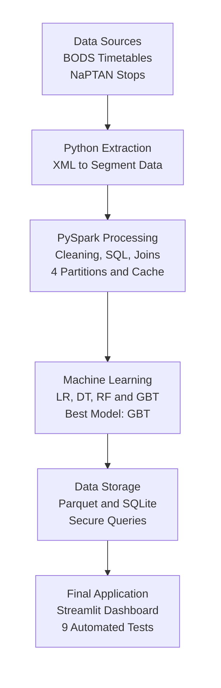

# System Architecture

```mermaid
flowchart TB

    subgraph TOP[" "]
        direction LR
        A["Data Sources<br/>BODS Timetables<br/>NaPTAN Stops"]
        B["Python Extraction<br/>XML to Segment Data"]
        C["PySpark Processing<br/>Cleaning, SQL, Joins<br/>4 Partitions and Cache"]

        A --> B --> C
    end

    subgraph BOTTOM[" "]
        direction LR
        D["Machine Learning<br/>LR, DT, RF and GBT<br/>Best Model: GBT"]
        E["Data Storage<br/>Parquet and SQLite<br/>Secure Queries"]
        F["Final Application<br/>Streamlit Dashboard<br/>9 Automated Tests"]

        D --> E --> F
    end

    C --> D

    style TOP fill:none,stroke:none
    style BOTTOM fill:none,stroke:none
```